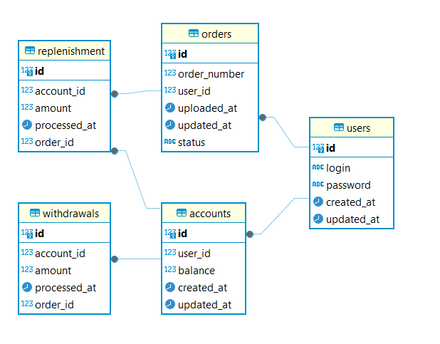
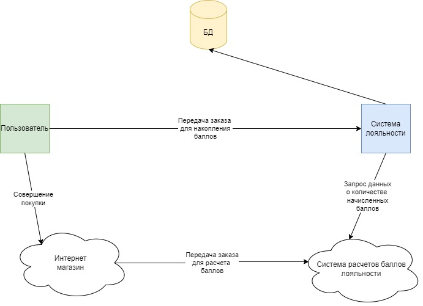
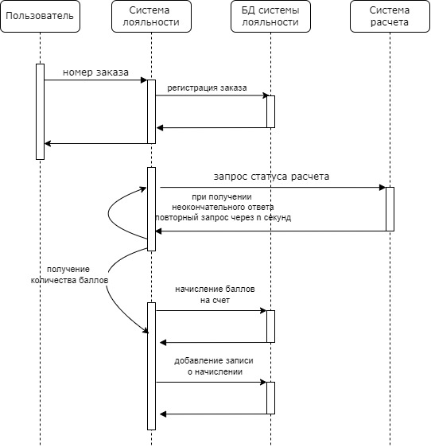
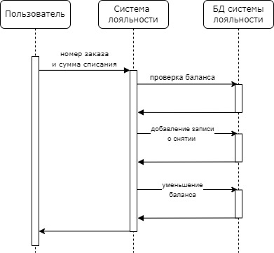

# cmd/gophermart

## Система накопления баллов лояльности.

### 1. ER-Диаграмма

### 2. Схема взаимодействия

### 3. Диаграмма последовательности для начисления баллов

Последовательность действий:
 1. Пользователь присылает запрос на добавление заказа в систему лояльности (далее СЛ)
 2. СЛ создает запись в таблице orders БД со статусом NEW и возвращает ответ пользователю 
 3. СЛ посылает запрос в систему расчета баллов (далее СРБ)
 4. При получении количества баллов от СРБ:
    1. <начало транзакции> СЛ создает запись в таблице replenishment 
    2. выставляет заказу статус PROCESSED  
    3. пополняет баланс на соответствующую сумму <конец транзакции>
 5. При получении окончательного негативного ответа от СРБ СЛ выставляет заказу статус INVALID
 6. При получении неокончательного ответа от СРБ СЛ выставляет заказу статус PROCESSING 
 7. При получении ошибки сервера СРБ или таймаута СЛ оставляет у заказа статус NEW
 8. Для всех заказов со статусом PROCESSING или NEW будет запускаться сервис получения статуса от СРБ с заданной периодичностью

### 4. Диаграмма последовательности для списания баллов

Последовательность действий:
1. Пользователь присылает запрос в СЛ на списание баллов в счет оплаты заказа 
2. <начало транзакции> СЛ проверяет достаточно ли баллов на балансе счета
3. СЛ создает запись в таблице withdrawal БД 
4. СЛ списывает баллы с баланса счета пользователя <конец транзакции>
5. СЛ отправляет ответ пользователю